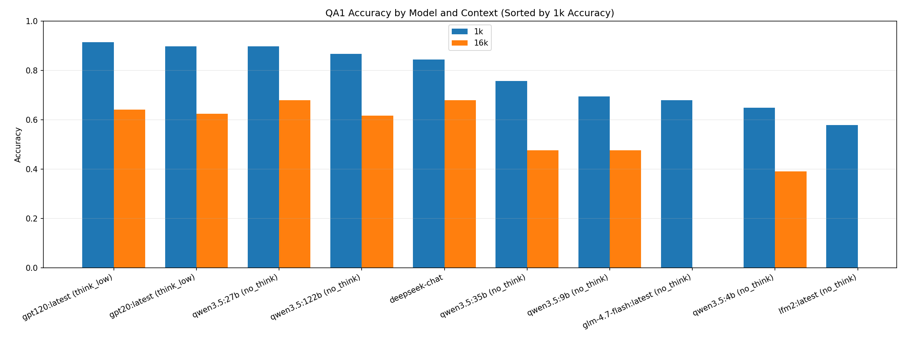
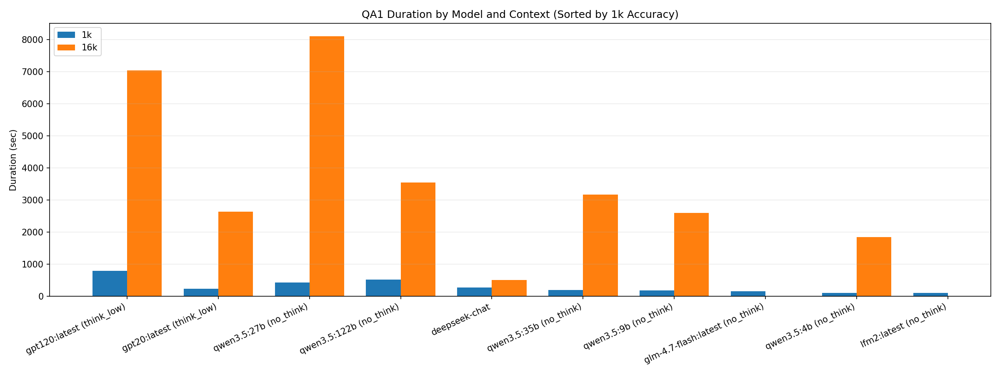

# BabiLong Benchmark Results

- Metric: BABILong official `compare_answers` -> `accuracy`
- Required fields: num_samples, correct_count, empty_prediction_count, accuracy, duration_sec

## Visualizations

### Accuracy Comparison (1k vs 16k)

### Duration Comparison (1k vs 16k)

## deepseek-chat

| Model | Task | Context | Num Samples | Correct | Empty Outputs | Accuracy | Duration (sec) | Summary |
|---|---|---|---:|---:|---:|---:|---:|---|
| deepseek-chat | qa1 | 1k | 128 | 108 | 0 | 0.843750 | 276.530 | `/home/himura_shiro/Projects/BabiLong/experiments/deepseek/results/babilong_qa1_n128_deepseek-chat_summary_20260303_220710.json` |
| deepseek-chat | qa1 | 16k | 128 | 87 | 0 | 0.679688 | 507.607 | `/home/himura_shiro/Projects/BabiLong/experiments/deepseek/results/babilong_qa1_n128_deepseek-chat_summary_20260303_221200.json` |

## gpt20:latest (think_low)

| Model | Task | Context | Num Samples | Correct | Empty Outputs | Accuracy | Duration (sec) | Summary |
|---|---|---|---:|---:|---:|---:|---:|---|
| gpt20:latest (think_low) | qa1 | 1k | 128 | 115 | 0 | 0.898438 | 238.335 | `/home/himura_shiro/Projects/BabiLong/experiments/gpt-oss-20b/results/babilong_qa1_n128_gpt20:latest_think_low_summary_qa1_1k_gpt20_ctx24k_np256_thinklow_20260305_154847.json` |
| gpt20:latest (think_low) | qa1 | 16k | 128 | 80 | 7 | 0.625000 | 2638.073 | `/home/himura_shiro/Projects/BabiLong/experiments/gpt-oss-20b/results/babilong_qa1_n128_gpt20:latest_think_low_summary_qa1_16k_gpt20_ctx24k_np256_thinklow_retry_20260305_160636.json` |

## gpt120:latest (think_low)

| Model | Task | Context | Num Samples | Correct | Empty Outputs | Accuracy | Duration (sec) | Summary |
|---|---|---|---:|---:|---:|---:|---:|---|
| gpt120:latest (think_low) | qa1 | 1k | 128 | 117 | 3 | 0.914062 | 786.892 | `/home/himura_shiro/Projects/BabiLong/experiments/gpt-oss-120b/results/babilong_qa1_n128_gpt120:latest_think_low_summary_qa1_1k_gpt120_ctx24k_np256_thinklow_retry_20260305_173413.json` |
| gpt120:latest (think_low) | qa1 | 16k | 128 | 82 | 16 | 0.640625 | 7034.930 | `/home/himura_shiro/Projects/BabiLong/experiments/gpt-oss-120b/results/babilong_qa1_n128_gpt120:latest_think_low_summary_qa1_16k_gpt120_ctx24k_np256_thinklow_retry_20260305_181946.json` |

## glm-4.7-flash:latest (no_think)

| Model | Task | Context | Num Samples | Correct | Empty Outputs | Accuracy | Duration (sec) | Summary |
|---|---|---|---:|---:|---:|---:|---:|---|
| glm-4.7-flash:latest (no_think) | qa1 | 1k | 128 | 87 | 0 | 0.679688 | 154.363 | `/home/himura_shiro/Projects/BabiLong/experiments/glm-4.7-flash/results/babilong_qa1_n128_glm-4.7-flash:latest_no_think_summary_qa1_1k_glm47_ctx24k_np24_nothink_retry_20260305_202114.json` |

## lfm2:latest (no_think)

| Model | Task | Context | Num Samples | Correct | Empty Outputs | Accuracy | Duration (sec) | Summary |
|---|---|---|---:|---:|---:|---:|---:|---|
| lfm2:latest (no_think) | qa1 | 1k | 128 | 74 | 0 | 0.578125 | 104.784 | `/home/himura_shiro/Projects/BabiLong/experiments/lfm2/results/babilong_qa1_n128_lfm2:latest_no_think_summary_qa1_1k_lfm2_ctx24k_np24_nothink_retry_20260305_202734.json` |

## qwen3.5:4b (no_think)

| Model | Task | Context | Num Samples | Correct | Empty Outputs | Accuracy | Duration (sec) | Summary |
|---|---|---|---:|---:|---:|---:|---:|---|
| qwen3.5:4b (no_think) | qa1 | 1k | 128 | 83 | 0 | 0.648438 | 107.415 | `/home/himura_shiro/Projects/BabiLong/experiments/qwen3.5-4b/results/babilong_qa1_n128_qwen3.5:4b_no_think_summary_20260303_222542.json` |
| qwen3.5:4b (no_think) | qa1 | 16k | 128 | 50 | 0 | 0.390625 | 1839.011 | `/home/himura_shiro/Projects/BabiLong/experiments/qwen3.5-4b/results/babilong_qa1_n128_qwen3.5:4b_no_think_ctx24576_summary_20260303_231955.json` |

## qwen3.5:9b (no_think)

| Model | Task | Context | Num Samples | Correct | Empty Outputs | Accuracy | Duration (sec) | Summary |
|---|---|---|---:|---:|---:|---:|---:|---|
| qwen3.5:9b (no_think) | qa1 | 1k | 128 | 89 | 0 | 0.695312 | 182.315 | `/home/himura_shiro/Projects/BabiLong/experiments/qwen3.5-9b/results/babilong_qa1_n128_qwen3.5:9b_no_think_summary_20260303_224817.json` |
| qwen3.5:9b (no_think) | qa1 | 16k | 128 | 61 | 0 | 0.476562 | 2601.021 | `/home/himura_shiro/Projects/BabiLong/experiments/qwen3.5-9b/results/babilong_qa1_n128_qwen3.5:9b_no_think_summary_20260305_002307.json` |

## qwen3.5:27b (no_think)

| Model | Task | Context | Num Samples | Correct | Empty Outputs | Accuracy | Duration (sec) | Summary |
|---|---|---|---:|---:|---:|---:|---:|---|
| qwen3.5:27b (no_think) | qa1 | 1k | 128 | 115 | 0 | 0.898438 | 428.283 | `/home/himura_shiro/Projects/BabiLong/experiments/qwen3.5-27b/results/babilong_qa1_n128_qwen3.5:27b_no_think_summary_qa1_1k_qwen35_27b_ctx24k_np24_20260305_125635.json` |
| qwen3.5:27b (no_think) | qa1 | 16k | 128 | 87 | 1 | 0.679688 | 8099.563 | `/home/himura_shiro/Projects/BabiLong/experiments/qwen3.5-27b/results/babilong_qa1_n128_qwen3.5:27b_no_think_summary_qa1_16k_qwen35_27b_ctx24k_np24_20260305_130519.json` |

## qwen3.5:35b (no_think)

| Model | Task | Context | Num Samples | Correct | Empty Outputs | Accuracy | Duration (sec) | Summary |
|---|---|---|---:|---:|---:|---:|---:|---|
| qwen3.5:35b (no_think) | qa1 | 1k | 128 | 97 | 0 | 0.757812 | 190.250 | `/home/himura_shiro/Projects/BabiLong/experiments/qwen3.5-35b/results/babilong_qa1_n128_qwen3.5:35b_no_think_summary_20260305_080129.json` |
| qwen3.5:35b (no_think) | qa1 | 16k | 128 | 61 | 0 | 0.476562 | 3168.002 | `/home/himura_shiro/Projects/BabiLong/experiments/qwen3.5-35b/results/babilong_qa1_n128_qwen3.5:35b_no_think_summary_qa1_16k_35b_ctx24k_np32_20260305_083302.json` |

## qwen3.5:122b (no_think)

| Model | Task | Context | Num Samples | Correct | Empty Outputs | Accuracy | Duration (sec) | Summary |
|---|---|---|---:|---:|---:|---:|---:|---|
| qwen3.5:122b (no_think) | qa1 | 1k | 128 | 111 | 0 | 0.867188 | 512.664 | `/home/himura_shiro/Projects/BabiLong/experiments/qwen3.5-122b/results/babilong_qa1_n128_qwen3.5:122b_no_think_summary_qa1_1k_qwen35_122b_ctx24k_np16_20260305_093743.json` |
| qwen3.5:122b (no_think) | qa1 | 16k | 128 | 79 | 3 | 0.617188 | 3547.324 | `/home/himura_shiro/Projects/BabiLong/experiments/qwen3.5-122b/results/babilong_qa1_n128_qwen3.5:122b_no_think_summary_qa1_16k_qwen35_122b_ctx24k_np16_20260305_095806.json` |
